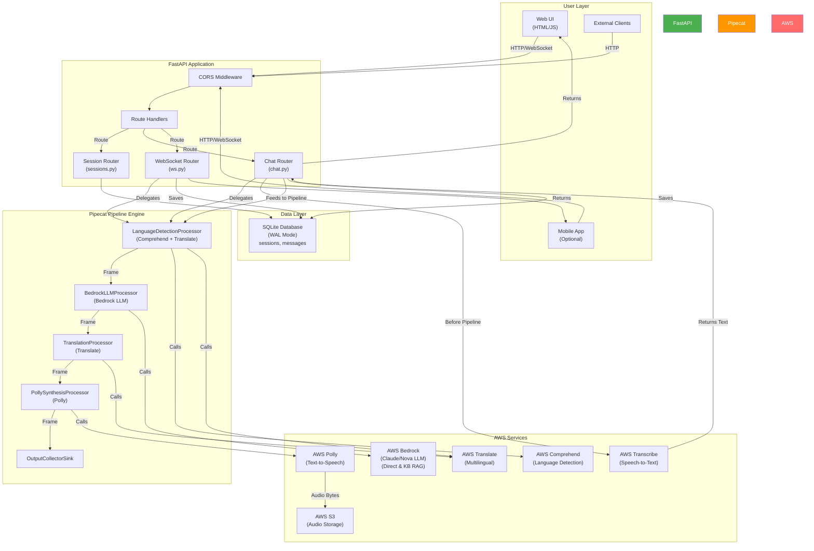

# BharatBot — Multilingual Voice Chat System

**Version:** 3.0.0 (Pipecat Edition)  
**Last Updated:** June 2024

---

## Table of Contents

1. [Project Overview](#project-overview)
2. [Purpose and Business Goal](#purpose-and-business-goal)
3. [Key Components](#key-components)
4. [Technology Stack](#technology-stack)
5. [Folder Structure Summary](#folder-structure-summary)
6. [Architecture Diagram](#architecture-diagram)
7. [Request/Response Flow](#requestresponse-flow)
8. [Data Flow Explanation](#data-flow-explanation)
9. [External Integrations](#external-integrations)
10. [Deployment Architecture](#deployment-architecture)
11. [Key Design Decisions](#key-design-decisions)
12. [Assumptions & Areas for Manual Review](#assumptions--areas-for-manual-review)

---

## Project Overview

**BharatBot** is a multilingual, voice-enabled conversational AI system built for real-time interactions with users across India and beyond. The system supports **Hindi, Marathi, and English** (individually or mixed) in a single conversation turn.

### Core Capabilities

- **Multilingual Voice Input:** Users can speak in Hindi, Marathi, or English
- **Real-time Processing Pipeline:** Leverages the **Pipecat AI framework** for orchestrating complex multi-step AI workflows
- **Intelligent Language Handling:** Automatic language detection, translation, and response generation
- **Dual Interface:** HTTP REST API and WebSocket for real-time two-way chat
- **Session Management:** Persistent conversation history with SQLite
- **Knowledge Base Integration:** Optional RAG (Retrieval-Augmented Generation) via AWS Bedrock Knowledge Bases

---

## Purpose and Business Goal

**Primary Purpose:**  
To provide a conversational AI assistant that breaks language barriers for Hindi/Marathi/English speakers, allowing them to communicate naturally in their preferred language while receiving intelligent, contextually relevant responses.

**Business Goals:**

1. **Accessibility:** Enable multilingual users in India to interact with AI in their native language
2. **Scalability:** Support real-time, low-latency voice conversations at scale
3. **Reliability:** Maintain session persistence and conversation history
4. **Extensibility:** Allow integration with custom knowledge bases and enterprise data
5. **User Experience:** Provide both simple HTTP API and real-time WebSocket interfaces

---

## Key Components

### 1. **FastAPI Application (mainV2.py)**

- **Entry Point:** Initializes the FastAPI server with CORS, logging, and middleware
- **Routing:** Registers three router modules (sessions, chat, WebSocket)
- **Logging:** Dual logging to console and rotating file handlers
- **Health Check:** `/health` endpoint for uptime monitoring
- **UI:** Static HTML UI served at `/ui`

### 2. **Pipecat Pipeline (pipelines/bharatbot_pipeline.py)**

The heart of the system. A composable, event-driven processing pipeline with five sequential stages:

```
BharatBotFrame
    ↓
LanguageDetectionProcessor      [Detect language(s), translate to English]
    ↓
BedrockLLMProcessor             [Call Bedrock direct or KB RAG]
    ↓
TranslationProcessor            [Translate English response back to user's language]
    ↓
PollySynthesisProcessor         [Generate MP3 audio via Polly TTS]
    ↓
OutputCollectorSink             [Collect the final BharatBotContext]
```

**Key Design:** Each processor is a `FrameProcessor` that:
- Receives a frame containing `BharatBotContext`
- Mutates the context asynchronously
- Passes the frame downstream

### 3. **Routers (routers/)**

#### **sessions.py**
- CRUD operations for conversation sessions
- Session metadata: title, language preference, creation/update timestamps
- Endpoints:
  - `POST /sessions` — Create new session
  - `GET /sessions` — List sessions with pagination
  - `GET /sessions/{id}` — Get single session details
  - `PATCH /sessions/{id}` — Update session metadata
  - `DELETE /sessions/{id}` — Soft-delete session
  - `GET /sessions/{id}/messages` — Retrieve conversation history
  - `DELETE /sessions/{id}/messages` — Clear messages

#### **chat.py**
- Stateful and stateless chat endpoints
- Delegates all LLM/audio logic to the Pipecat pipeline
- Validates input, loads session state, and persists turns to DB
- Endpoints:
  - `POST /sessions/{id}/chat/text` — Text chat (session-scoped)
  - `POST /sessions/{id}/chat/voice` — Voice chat (session-scoped)
  - `POST /chat/text` — Stateless text chat
  - `POST /chat/voice` — Stateless voice chat
  - `POST /tts` — On-demand text-to-speech
  - `GET /sessions/{id}/messages/{msg_id}/audio` — Retrieve audio for past message

#### **ws.py**
- WebSocket endpoint for real-time bidirectional chat
- Handles both text and voice messages over a single persistent connection
- Protocol uses JSON messages with `type`, `text`/`audio_b64`, and `session_id`
- Server responses include `ack`, `response`, `error`, and `pong` messages
- Endpoint: `GET /ws/chat`

### 4. **Services (services/)**

#### **aws_clients.py**
- Singleton boto3 clients for AWS services
- Configured from `.env` environment variables
- Clients:
  - `bedrock` — LLM inference (direct model invocation)
  - `bedrock_agent` — Knowledge Base RAG
  - `translate` — Language translation
  - `transcribe` — Speech-to-text (STT)
  - `polly` — Text-to-speech (TTS)
  - `s3` — Audio file storage
  - `comprehend` — Language detection

#### **db.py**
- SQLite connection management with WAL mode
- Database schema initialization (sessions, messages tables)
- CRUD operations for sessions and messages
- Row factory for easy dict-like access
- Context manager for automatic commit/rollback

#### **language.py**
- `detect_languages(text)` — Uses AWS Comprehend to detect languages in user input
- `translate_to_english_mixed(text)` — Translates input to English for LLM processing
- `translate_from_english(text, lang)` — Translates LLM response back to target language

#### **audio.py**
- `synthesise_speech(text, lang)` — Convert text to MP3 via AWS Polly
- `transcribe_audio(file_path)` — Convert speech to text via AWS Transcribe
- `transcribe_audio_bytes(audio_bytes)` — Transcribe from raw bytes
- `upload_audio_to_s3(audio_bytes)` — Upload MP3 to S3 with presigned URLs
- Polly voice mapping (Hindi & Marathi use Kajal neural voice)

#### **llm.py**
- `call_bedrock(user_message, history)` — Routes to direct or KB RAG based on configuration
- `_call_bedrock_direct(user_message, history)` — Direct model invocation with Claude
- `_call_bedrock_kb(user_message)` — Knowledge Base RAG with hybrid search

### 5. **Database (SQLite)**

Two main tables:

**sessions**
- `session_id` (PK): Unique session identifier
- `created_at`, `updated_at`: Timestamps
- `title`: Human-readable session name
- `lang`: User's language preference (en, hi, mr)
- `is_active`: Soft-delete flag (0 = deleted)

**messages**
- `message_id` (PK): Unique message identifier
- `session_id` (FK): Reference to session
- `role`: "user" or "assistant"
- `content_type`: "text" or "voice"
- `original_text`: User input in original language
- `english_text`: Translated to English (for LLM context)
- `response_text`: Assistant response in target language
- `detected_lang`: Language detected for this message
- `audio_s3_uri`: S3 URI for audio output (if applicable)
- `has_audio_out`: Boolean flag for audio availability
- `created_at`: Message timestamp

---

## Technology Stack

| Layer | Technology | Purpose |
|-------|------------|---------|
| **Framework** | FastAPI 0.104+ | HTTP API & WebSocket server |
| **Server** | Uvicorn | ASGI application server |
| **Language** | Python 3.9+ | Core application language |
| **Pipeline Orchestration** | Pipecat AI 1.x | Real-time frame-based processing |
| **Database** | SQLite 3 (WAL mode) | Conversation history & session storage |
| **AI Models** | AWS Bedrock | LLM inference (Claude, Nova) |
| **Speech-to-Text** | AWS Transcribe | Voice input processing |
| **Text-to-Speech** | AWS Polly | Voice output generation |
| **Language Detection** | AWS Comprehend | Language identification |
| **Translation** | AWS Translate | Multilingual text translation |
| **Storage** | AWS S3 | Audio file persistence |
| **Configuration** | python-dotenv | Environment variable management |
| **HTTP Client** | aiofiles, asyncio | Async file handling |

---

## Folder Structure Summary

```
bharatbot/
│
├── mainV2.py                          # ★ FastAPI app entry point
├── bharatbot.db                       # SQLite database (WAL mode)
├── bharatbot_ui2.html                 # Static HTML UI
├── requirements.txt                   # Python dependencies
├── .env.example                       # Environment variables template
├── .env                               # Actual credentials (not in git)
│
├── models/
│   └── schemas.py                     # Pydantic request/response models
│
├── services/
│   ├── __init__.py
│   ├── aws_clients.py                 # Boto3 client singletons
│   ├── db.py                          # SQLite CRUD & schema
│   ├── language.py                    # Comprehend + Translate
│   ├── audio.py                       # Polly TTS + Transcribe STT + S3
│   └── llm.py                         # Bedrock direct & KB RAG
│
├── pipelines/
│   ├── __init__.py
│   └── bharatbot_pipeline.py          # ★ Pipecat processors & pipeline
│
├── routers/
│   ├── __init__.py
│   ├── sessions.py                    # Session CRUD endpoints
│   ├── chat.py                        # Text/voice chat endpoints
│   └── ws.py                          # WebSocket chat endpoint
│
├── logs/
│   ├── bharatbot.log                  # Main rotating log file
│   └── bharatbot_with_pipecatAudioStreamingWebsocket*.log  # Timestamped logs
│
├── venv/                              # Python virtual environment
└── __pycache__/                       # Python bytecode cache
```

---

## Architecture Diagram



---

## Request/Response Flow

### HTTP Text Chat Flow

```
1. Client sends:
   POST /sessions/{session_id}/chat/text
   Content-Type: application/x-www-form-urlencoded
   text=<user input in any language>

2. Server:
   a) Load session from SQLite (validate language preference)
   b) Fetch conversation history from DB (last 20 turns)
   c) Create BharatBotContext with user text
   d) Run through Pipecat pipeline:
      - LanguageDetectionProcessor: Detect language, translate to English
      - BedrockLLMProcessor: Call Bedrock LLM with English + history
      - TranslationProcessor: Translate response back to detected language
      - PollySynthesisProcessor: Generate MP3 audio
      - OutputCollectorSink: Collect results
   e) Save turn to SQLite (user + assistant messages)
   f) Encode audio as base64

3. Client receives:
   {
     "status": "success",
     "session_id": "...",
     "original_text": "नमस्ते",
     "detected_lang": "hi",
     "english_text": "Hello",
     "response_text": "नमस्ते! मैं आपकी कैसे मदद कर सकता हूं?",
     "audio_base64": "//NExAA...",
     "timings": { "pipeline": 2.34, "db_save": 0.12, "total": 2.46 }
   }
```

### HTTP Voice Chat Flow

```
1. Client sends:
   POST /sessions/{session_id}/chat/voice
   Content-Type: multipart/form-data
   audio=<binary WAV/OGG data>

2. Server:
   a) Load session from SQLite
   b) Call AWS Transcribe to convert speech → text
      (Transcribe auto-detects language)
   c) Continue as Text Chat Flow (step 2c onwards)

3. Client receives:
   Same as Text Chat + transcript field with spoken text
```

### WebSocket Flow

```
1. Client connects:
   WebSocket /ws/chat

2. Client sends (JSON):
   { "type": "text", "text": "...", "session_id": "..." }
   or
   { "type": "voice", "audio_b64": "<base64>", "session_id": "..." }
   or
   { "type": "ping" }

3. Server responds (JSON):
   { "type": "ack", "mode": "text|voice" }
   (Processing starts)
   
   ... runs through Pipecat pipeline ...
   
   { "type": "response", 
     "response_text": "...",
     "audio_base64": "...",
     "detected_langs": ["hi"],
     "dominant_lang": "hi",
     "transcript": "..."  // if voice input
   }
   or
   { "type": "error", "detail": "..." }
   
   For ping:
   { "type": "pong" }

4. Connection persists for multiple turns
   (No reconnect needed; session state reloaded for each turn)
```

---

## Data Flow Explanation

### Multi-Language Processing Flow

```
User Input (Any Language)
    ↓
[AWS Comprehend] Detect Language(s)
    ↓
[AWS Translate] Translate to English (if needed)
    ↓
[AWS Bedrock] Process in English + History
    ↓
[AWS Translate] Translate Response back to Detected Language
    ↓
[AWS Polly] Synthesize Speech in Target Language
    ↓
Audio Output + Text Response
    ↓
[SQLite] Store session turn for history
```

### Session Persistence

```
Session Created
    ↓
[SQLite] Insert into sessions table
    ↓
Each Chat Turn:
    ├── [Load] Fetch session + history from DB
    ├── [Process] Run through Pipecat pipeline
    ├── [Save] Persist user message to DB
    └── [Save] Persist assistant response to DB
    ↓
Next Turn:
    ├── [Load] Re-fetch updated history (includes previous turn)
    └── [Context] LLM sees full conversation history
```

### Audio Storage Strategy

```
Response Generated (MP3 bytes)
    ↓
Option 1: Store in S3
    ├── [S3] Upload MP3 to s3://bucket/sfl-practice/tm-audio/<uuid>.mp3
    ├── [DB] Store S3 URI in messages.audio_s3_uri
    └── [Return] Send to client via presigned URL
    
Option 2: In-Memory (Current)
    ├── [Encode] Base64 encode MP3 bytes
    └── [Return] Send directly in JSON response
```

---

## External Integrations

### AWS Bedrock

**Purpose:** Large Language Model (LLM) inference  
**Models:** Claude (Anthropic), Nova (Amazon)  
**Integration:** 
- Direct model invocation: `bedrock.invoke_model()`
- Knowledge Base RAG: `bedrock_agent.retrieve_and_generate()` (optional)

**Configuration:** 
- `BEDROCK_MODEL_ID`: Model to use (e.g., `amazon.nova-lite-v1:0`)
- `BEDROCK_KB_ID`: Knowledge Base ID (if using RAG)

---

### AWS Transcribe

**Purpose:** Convert speech to text  
**Features:**
- Automatic language detection from audio
- Supports Hindi, Marathi, English, and mixed-language audio

**Integration:** Async job-based or real-time streaming  
**Configuration:** `AWS_REGION` (e.g., `us-east-1`)

---

### AWS Polly

**Purpose:** Convert text to speech  
**Voices:**
- English: Joanna (neural)
- Hindi: Kajal (neural) — `hi-IN`
- Marathi: Kajal (neural) — `hi-IN` (mapped because Polly has no Marathi engine, but Kajal reads Devanagari)

**Output:** MP3 format  
**Integration:** Synchronous `polly.synthesize_speech()`

---

### AWS Comprehend

**Purpose:** Detect language(s) in text  
**Features:**
- Multi-script detection (Devanagari for Hindi/Marathi)
- Confidence scores per language

**Integration:** `comprehend.detect_dominant_language()` or `detect_entities()` for language hints

---

### AWS Translate

**Purpose:** Multilingual text translation  
**Features:**
- Supports Hindi ↔ English, Marathi ↔ English, and many others
- Transliterations and back-translations

**Integration:** `translate.translate_text()`

---

### AWS S3

**Purpose:** Persistent audio file storage  
**Bucket:** `aether-dev-data` (configurable)  
**Path:** `sfl-practice/tm-audio/<uuid>.mp3`

**Features:**
- Presigned URLs for secure, temporary access
- Versioning and lifecycle policies (optional)

---

## Deployment Architecture

### Development Setup

```
Local Machine
    ↓
Python venv (requirements.txt)
    ↓
Uvicorn Server (--reload flag)
    ↓
FastAPI routes ← → SQLite (local)
    ↓
AWS Services (via boto3 with credentials from .env)
```

### Production Setup (Conceptual)

```
User Requests
    ↓
Load Balancer (ALB/NLB)
    ↓
EC2 / ECS Task (BharatBot server)
    ├── FastAPI + Uvicorn
    ├── SQLite with WAL mode (or RDS Postgres for scale)
    └── Connection pooling
    ↓
AWS Services
    ├── Bedrock (managed)
    ├── Transcribe/Polly/Translate/Comprehend (managed)
    ├── S3 (managed)
    └── Optional: VPC, security groups, IAM roles
```

### Environment Configuration

**Required .env Variables:**

```
AWS_REGION=us-east-1
AWS_ACCESS_KEY_ID=<your-key>
AWS_SECRET_ACCESS_KEY=<your-secret>
AWS_SESSION_TOKEN=<optional-session-token>

BEDROCK_MODEL_ID=amazon.nova-lite-v1:0
BEDROCK_KB_ID=<optional-kb-id>

S3_BUCKET_NAME=aether-dev-data
DB_PATH=bharatbot.db
```

---

## Key Design Decisions

### 1. **Pipecat Pipeline Architecture**

**Decision:** Use Pipecat 1.x frame-based pipeline instead of sequential function calls  
**Rationale:**
- Composable: Easy to add/remove processors without modifying existing code
- Async-friendly: All processors run asynchronously with executor pools for I/O-heavy tasks
- Observable: Frame flow makes debugging and logging transparent
- Scalable: Processor pattern allows for future GPU acceleration or external worker pools

### 2. **Language Translation Strategy**

**Decision:** Translate user input to English, process with LLM, translate response back  
**Rationale:**
- Bedrock models are primarily English-trained; translating to English improves LLM quality
- LLM in English + history provides consistent context
- Response translated back to user's detected language (or session preference)
- Fallback: If translation fails, use original text

### 3. **Session-Based Conversation History**

**Decision:** Store full conversation history in SQLite; re-fetch on each turn  
**Rationale:**
- Simple, no distributed cache complexity
- LLM gets full context for better coherence
- Easy audit trail for compliance
- Limits: History capped at last 20 turns (configurable) to avoid token overflow

### 4. **Dual Input Interfaces (HTTP + WebSocket)**

**Decision:** Support both REST and WebSocket endpoints  
**Rationale:**
- HTTP: Simple, stateless, works with any client
- WebSocket: Real-time, persistent connection, ideal for voice interactions
- Clients can choose based on use case (batch processing vs. real-time chat)

### 5. **Polly Voice Mapping**

**Decision:** Map Marathi (`mr`) to Hindi neural voice (`hi-IN`)  
**Rationale:**
- Polly has no native Marathi engine
- Kajal neural voice reads Devanagari script correctly for both Hindi and Marathi
- Avoids errors on unsupported language codes on neural engine

### 6. **Audio Handling Strategy**

**Decision:** Encode MP3 to base64; return in JSON (not separate binary file)  
**Rationale:**
- Simple, single JSON response (no multipart downloads)
- Works across firewalls and proxies
- Client can decode and play immediately
- S3 integration available for larger deployments

### 7. **Soft Delete for Sessions**

**Decision:** Use `is_active` flag instead of hard DELETE  
**Rationale:**
- Audit trail: Keep deleted sessions in DB for compliance
- Undelete capability: Users can recover sessions
- Referential integrity: No risk of orphaned messages

### 8. **SQLite WAL Mode**

**Decision:** Enable Write-Ahead Logging (WAL)  
**Rationale:**
- Better concurrency: Readers and writers don't block each other
- Durability: Safer for async writes
- No journal file cleanup issues

### 9. **Stateless Router Design**

**Decision:** Routers validate input and delegate to shared services/pipeline  
**Rationale:**
- Single source of truth: Pipecat pipeline logic is centralized
- Testable: Easy to unit test individual processors
- Maintainable: Adding a new route doesn't require duplicating pipeline logic

### 10. **Logging Strategy**

**Decision:** Dual logging to console and rotating file with timing breakdown  
**Rationale:**
- Console: Real-time feedback during development (--reload)
- File: Persistent logs for production debugging
- Timing: Break down pipeline stages (LangDetect, LLM, Translate, TTS, DB) for performance analysis
- Rotation: Prevent log files from consuming disk space

---

## Assumptions & Areas for Manual Review

### Technical Assumptions

1. **AWS Credentials Available:** The system assumes valid AWS credentials are present in `.env` or IAM role (for EC2/ECS). No fallback or anonymous access.

2. **Language Coverage:** System assumes Comprehend correctly detects Hindi, Marathi, and English. Mixing scripts (e.g., Roman transliteration of Hindi) may not be detected correctly.

3. **Bedrock Model Availability:** Assumes `BEDROCK_MODEL_ID` model exists in the specified region and the account has quota.

4. **Polly Neural Engine:** Assumes Kajal (neural) voice is available in the region. Falls back to standard voice if not.

5. **S3 Bucket Permissions:** Assumes S3 bucket exists and boto3 credentials have `PutObject`, `GetObject`, `ListBucket` permissions.

6. **SQLite Disk Access:** Assumes the server has read/write access to the local filesystem for `bharatbot.db`. WAL mode requires same-filesystem access (not network-mounted).

### Operational Assumptions

1. **Single Server Instance:** Current design assumes one server instance. Multiple instances would require:
   - Shared database (RDS PostgreSQL recommended)
   - Shared file storage (S3 for audio, not local)
   - Session affinity or sticky connections (not required with shared DB)

2. **No Load Balancing Yet:** The application is not designed for multi-server deployment without modifications.

3. **No Rate Limiting:** No built-in rate limiting. Recommended to add at load balancer or API gateway level.

4. **No Authentication/Authorization:** System assumes all users are trusted. No JWT, API keys, or role-based access control.

### Areas Requiring Manual Review

1. **Token Limits:** Bedrock models have max input/output token limits. If conversation history grows, LLM calls may fail. Review and implement history truncation strategy.

2. **Audio Quality vs. Latency:** Polly neural voices are slower than standard voices. For real-time applications, consider trade-off or preprocessing.

3. **Language Mixing:** System detects one dominant language per turn. True code-switching (mixed Hindi-English in one sentence) may not work perfectly.

4. **Cost Optimization:** Each request hits multiple AWS services (Comprehend, Translate, Bedrock, Polly). For high volume, consider caching or batch processing.

5. **Error Handling:** Current error messages are generic. Add more granular error codes for client-side handling.

6. **Monitoring & Alerts:** No built-in monitoring of:
   - AWS service quota usage
   - Response latency SLAs
   - Error rate thresholds
   - Database size growth

7. **Backup & Recovery:** No automated backup for SQLite. Implement daily exports to S3 or migrate to managed database.

8. **Security Review:**
   - No input sanitization for SQL injection (SQLite prepared statements used, so safe)
   - WebSocket doesn't enforce HTTPS/WSS in code (rely on infrastructure)
   - No request size limits on audio uploads
   - No encryption at rest for SQLite

9. **Scalability Limits:**
   - SQLite max database size: ~1TB (practical limit lower)
   - Uvicorn workers: Single-threaded event loop. Use multiple workers with Gunicorn for production.
   - Pipecat pipeline: All processors run sequentially. No parallelization within pipeline.

10. **Testing Strategy:** No unit tests, integration tests, or load tests provided. Recommend adding pytest suite.

---

## Getting Started

### Prerequisites

- Python 3.9+
- AWS account with Bedrock, Polly, Transcribe, Comprehend, Translate, S3 access
- boto3 credentials configured

### Setup

```bash
# Clone and navigate
cd /path/to/bharatbot

# Create virtual environment
python -m venv venv
source venv/bin/activate  # On Windows: venv\Scripts\activate

# Install dependencies
pip install -r requirements.txt

# Configure environment
cp .env.example .env
# Edit .env with your AWS credentials and model IDs

# Run the server
uvicorn mainV2:app --reload --host 0.0.0.0 --port 8000
```

### Test the API

```bash
# Health check
curl http://localhost:8000/health

# Create session
curl -X POST http://localhost:8000/sessions \
  -H "Content-Type: application/json" \
  -d '{"title": "Test Chat", "lang": "hi"}'

# Text chat
curl -X POST http://localhost:8000/sessions/{session_id}/chat/text \
  -d "text=नमस्ते"

# Access UI
open http://localhost:8000/ui
```

---

## Contact & Support

For questions about architecture or system design, refer to:
- README.md for quick start
- Code comments in `pipelines/bharatbot_pipeline.py` for pipeline details
- Log output (logs/bharatbot*.log) for debugging

---

**End of Architecture Documentation**
